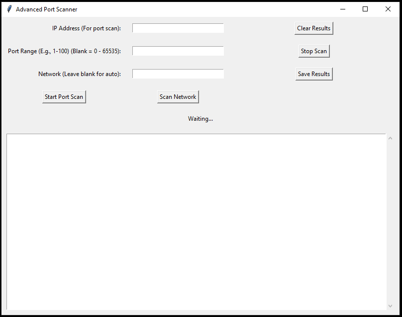

# Port Scanner

A simple Python-based port and network scanner built with `tkinter` for GUI, designed for **educational and testing purposes only**. This tool allows users to scan ports on a specific IP address or discover active devices on a local network. It provides progress tracking and basic service detection for open ports.

## Prerequisites

Before using this tool, ensure the following are installed on your system:

- **Python 3.x:** The script is written in Python and requires a compatible version.
- **nmap:** This tool relies on the `nmap` command-line utility for network scanning and service detection. You must install it manually:
- **Python libraries:** Install the required Python packages listed in `requirements.txt` (see Installation section below).

**Note:** Ensure `nmap` is accessible from your command line (e.g., added to your system's PATH).

## Installation

1. Clone this repository
2. Install the required Python libraries: `pip install -r requirements.txt`
3. Verify that nmap is installed: `nmap -v`
4. `python Port_Scanner.py`

Features
+ **Port Scanning:** Enter an IP address and port range (e.g., 1-100) to scan for open ports. Displays open ports with detected services.
+ **Network Scanning:** Automatically detects your local network to discover active devices with their hostnames.
+ **Save Results:** You can save the scan data as .txt file.
+ **GUI:** Built with tkinter for an interface.

### Screenshot

